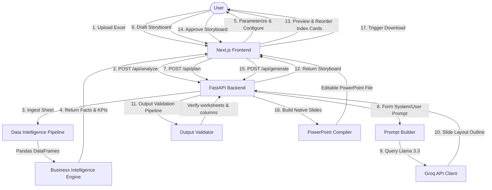

# DeckMate: AI-Assisted Excel to PowerPoint Presentation Automation

DeckMate is a production-grade, stateless presentation automation engine. It audits uploaded Excel spreadsheets, computes business KPIs/trends deterministically via Pandas, plans slide deck outlines using Llama 3.3 (via Groq), and generates widescreen, fully-editable PowerPoint slide files containing native visual elements and charts.

---

## 🏛 Architecture Diagram



---

## 📁 Repository Directory Structure

```text
AI-Presentation_automation/
├── backend/
│   ├── app/
│   │   ├── schemas/
│   │   │   ├── __init__.py
│   │   │   └── models.py                 # Pydantic schemas (Workbook summary, KPI, SlidePlan)
│   │   ├── services/
│   │   │   ├── __init__.py
│   │   │   ├── exceptions.py             # App errors (RateLimits, JSON violation, Validation)
│   │   │   ├── data_intelligence.py      # Pandas data loaders & column cleaners
│   │   │   ├── schema_detector.py        # Structural column types analyzer
│   │   │   ├── quality_analyzer.py       # Sheet health metrics & audit logs
│   │   │   ├── kpi_detector.py           # Metrics and performance aggregator
│   │   │   ├── trend_analyzer.py         # YoY/MoM growth vector calculator
│   │   │   ├── fact_generator.py         # Natural language insights compiler
│   │   │   ├── summary_builder.py        # BI data wrapper
│   │   │   ├── business_intelligence.py  # BI orchestrator service
│   │   │   ├── groq_client.py            # Groq API client with key rotation fallback
│   │   │   ├── prompt_builder.py         # Prompt assembler
│   │   │   ├── audience_adapter.py       # Tones configuration dictionary
│   │   │   ├── chart_validation.py       # Layout chart selector overrides
│   │   │   ├── recommendation_validator.py # Contradictory recommendation filters
│   │   │   ├── output_validator.py       # Reference checker against spreadsheet columns
│   │   │   ├── storyboard_generator.py   # Storyboard JSON parser
│   │   │   ├── presentation_planner.py   # AI planner orchestrator
│   │   │   ├── theme_manager.py          # Slide canvas custom colors and layouts
│   │   │   ├── template_registry.py      # Grid/Split layout mapping catalog
│   │   │   ├── layout_manager.py         # Inches scaling positions tracker
│   │   │   ├── text_renderer.py          # Font auto-scaling textbox writer
│   │   │   ├── content_renderer.py       # Slide segments and notes compiler
│   │   │   ├── shape_builder.py          # rounded KPI cards illustrator
│   │   │   ├── chart_builder.py          # Native MS PowerPoint editable chart drawers
│   │   │   ├── table_builder.py          # Alternating grid tables compiler
│   │   │   ├── slide_factory.py          # Slide layout compiler factory
│   │   │   ├── ppt_compiler.py           # PPTX compiler orchestrator
│   │   │   ├── export_service.py         # Binary IO file output exporter
│   │   │   └── main.py                   # FastAPI routing endpoints
│   │   └── __init__.py
│   ├── tests/
│   │   ├── test_bi_engine.py             # BI and Ingestion validators
│   │   ├── test_planning_layer.py        # AI layout validation tests
│   │   └── test_pptx_pipeline.py         # PPTX slide building tests
│   ├── .env                              # Environment credentials config
│   ├── requirements.txt                  # Python libraries dependency lists
│   └── pytest.ini
├── frontend/
│   ├── src/
│   │   └── app/
│   │       ├── globals.css               # Tailwind CSS declarations
│   │       ├── layout.tsx                # Page HTML structure & Google Fonts
│   │       └── page.tsx                  # Single-page Next.js dashboard UI
│   ├── package.json
│   ├── tailwind.config.ts
│   └── tsconfig.json
└── README.md                             # Operations documentation
```

---

## 🛠 Local Setup & Installation

### Prerequisite Dependencies
- **Node.js**: v18.0.0 or higher.
- **Python**: v3.10.0 or higher.

### 1. Backend Server Setup
1. Navigate into the backend directory:
   ```bash
   cd backend
   ```
2. Create and activate a python virtual environment:
   ```bash
   python -m venv venv
   # On Windows (PowerShell):
   .\venv\Scripts\Activate.ps1
   # On macOS/Linux:
   source venv/bin/activate
   ```
3. Install the dependencies:
   ```bash
   pip install -r requirements.txt
   ```
4. Configure environment credentials in `.env`:
   Create a `.env` file at the backend directory root:
   ```env
   GROQ_API_KEY=your_primary_key_here
   GROQ_API_KEY_FALLBACK=your_secondary_key_here
   GROQ_MODEL=llama-3.3-70b-versatile
   GROQ_TIMEOUT=30.0
   GROQ_MAX_RETRIES=3
   ```
5. Run the server using Uvicorn:
   ```bash
   python -m uvicorn app.main:app --host 127.0.0.1 --port 8000 --reload
   ```

### 2. Frontend Client Setup
1. Navigate into the frontend directory:
   ```bash
   cd ../frontend
   ```
2. Install npm dependencies:
   ```bash
   npm install
   ```
3. Configure frontend environment variables:
   Create a `.env.local` file under `frontend/`:
   ```env
   NEXT_PUBLIC_API_URL=http://127.0.0.1:8000
   ```
4. Start the Next.js development server:
   ```bash
   npm run dev
   ```
5. Open your browser and navigate to `http://localhost:3000`.

---

## 🧪 Testing Verification Suite

Verify all mathematical engines, LLM prompts, quality indicators, and slide compiling services by invoking the pytest test cases:
```bash
cd backend
python -m pytest tests/ -v
```

---

## 🚀 Production Deployment Instructions

### 1. Backend Hosting (e.g., Render)
1. Register a new **Web Service** on Render linked to your repository.
2. Configure environment settings:
   - **Environment**: `Python`
   - **Build Command**: `pip install -r backend/requirements.txt`
   - **Start Command**: `python -m uvicorn backend.app.main:app --host 0.0.0.0 --port $PORT`
3. Add environmental credentials:
   - `GROQ_API_KEY`: primary token.
   - `GROQ_API_KEY_FALLBACK`: rotation token.

### 2. Frontend Hosting (e.g., Vercel)
1. Add a new project on Vercel linked to the repository.
2. Select the `frontend` directory as the project root.
3. Configure environment settings:
   - **Framework Preset**: `Next.js`
   - **Build Command**: `npm run build`
   - **Output Directory**: `.next`
4. Set Environment Variables:
   - `NEXT_PUBLIC_API_URL`: URL of the deployed FastAPI backend on Render.

---

## ⚠ Known Limitations & System Boundaries

1. **Stateless Operations**: No databases, sessions, or user histories are kept. Uploaded files are immediately compiled into memory, mapped to slides, and returned to client streams. Refreshing the browser page resets the workspace.
2. **Spreadsheet Sizing Limits**: Excel sheets containing more than 20 worksheets or files larger than 15MB will trigger analysis timeouts.
3. **Editable Visual Limits**: Widescreen layouts limit individual tables to a maximum of 10 rows and charts to a maximum of 15 metrics values to prevent text overlapping or visual clutter.
