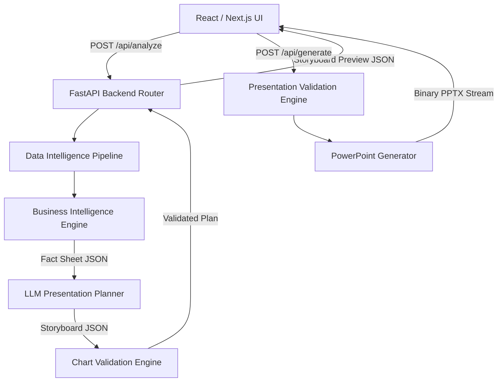
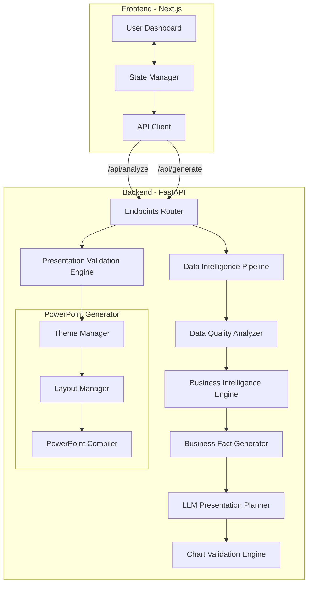
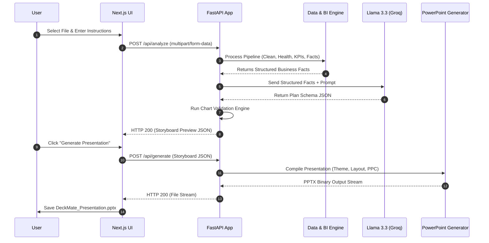
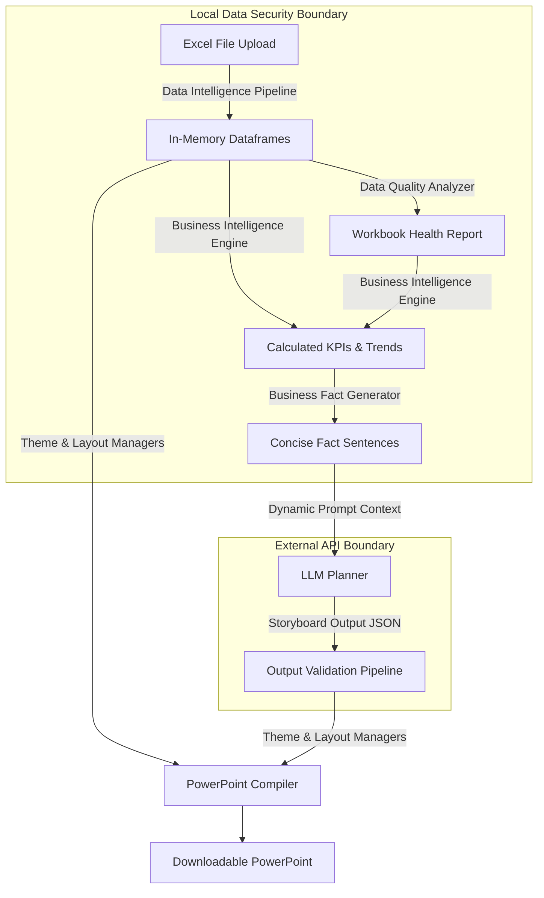

# Software Requirements Specification (SRS) for DeckMate

## 1. Executive Summary
**DeckMate** is a lightweight, self-contained presentation automation platform that converts raw, multi-sheet Excel workbooks (`.xlsx`) into professional, editable PowerPoint presentations (`.pptx`). 

DeckMate operates under a strict hybrid execution paradigm:
* **Python is the sole calculator**: Under no circumstances does the Large Language Model (LLM) compute aggregations, calculate trends, verify growth metrics, or modify numeric facts.
* **The LLM is the narrator and planner**: The LLM is used exclusively for narrative planning, copywriting, audience tone adaptation, slide sequencing, and generating presentation recommendations.

By keeping statistical computation and linguistic narration separate, DeckMate guarantees absolute factual accuracy (zero AI hallucinations on numeric values) while producing highly polished, editable business-ready slides.

---

## 2. Business Problem & Opportunity
In typical corporate reporting cycles, translating spreadsheet data into presentations is manually intensive and error-prone:
1. **Transposition Errors**: Copying performance values, metrics, and chart points manually from spreadsheets to slide decks introduces typing mistakes and version misalignment.
2. **Visual Inconsistency**: Slides compiled by different team members often feature misaligned margins, mismatched colors, incorrect typographic hierarchy, and inappropriate chart selections.
3. **High Operational Cost**: Analysts spend the majority of their time setting margins, aligning shapes, and formatting layouts rather than focus on identifying growth drivers or operational cost reductions.

DeckMate automates this pipeline. It runs deterministic cleaning, profiles data quality, computes statistical aggregates, and compiles structural storyboard outlines for user approval before generating native, editable slide presentations in seconds.

---

## 3. Project Objectives & Success Metrics
* **Factual Consistency**: 100% data consistency. Every metric and value displayed in the output presentation must match the computed source database.
* **Frictionless Workflow**: Total slide deck generation time (from workbook analysis to final file download) must complete in under 90 seconds.
* **Layout Design Alignment**: Zero visual overlaps. Content fits clean, predefined visual guidelines for text spacing, font sizes, and borders.
* **High Output Editability**: 100% of generated slide elements must remain editable. Tables, shapes, and charts must be rendered as native Microsoft PowerPoint XML shapes, rather than flat image exports.

---

## 4. Scope of the System
* **Workbook Cleaning**: Ingests multi-tab spreadsheets, handles missing fields, resolves duplicate headers, and parses mixed-type data columns.
* **Data Diagnostics**: Audits sheet anomalies, checks validation limits, and outputs a Workbook Health Report.
* **Descriptive Analysis**: Calculates sums, averages, counts, trends, rankings, and variances using Python.
* **Context Generation**: Produces concise business facts from calculated metrics to act as the primary context for the LLM.
* **Presentation Planning**: Leverages Llama 3.3 (via Groq API) to structure slide outlines, draft business insights, and adjust messaging to target audiences.
* **Visual Compilation**: Applies design-safe slide layouts, matches data shapes to target visualizations, and outputs editable presentation files.

---

## 5. Out of Scope
The following features are **explicitly out of scope** to keep the platform lightweight and modular:
* User registration, passwords, session histories, or roles.
* Persistent database servers (SQL/NoSQL) or remote document caches.
* Permanent file storage (S3/GCS) or shared link retrieval.
* Background task brokers (Celery/RQ), Redis caches, or event streams.
* Retrieval-Augmented Generation (RAG) indices or vector stores.
* Billing, notifications, admin dashboards, or real-time collaboration.

---

## 6. Target User Personas
* **Financial Analysts**: Need to build monthly performance reports from multi-tab operational logs.
* **Sales Leads**: Need to present sales metrics and target highlights to division directors.
* **Operations Leads**: Need to summarize throughput metrics, process bottlenecks, and quality issues.
* **Strategy Consultants**: Need a structured deck outline to begin refining business recommendations.

---

## 7. Functional Requirements Specification

| Req ID | Requirement | Priority | Description |
| :--- | :--- | :--- | :--- |
| **FR-1.1** | Workbook Upload | High | Ingests multi-sheet Excel files (`.xlsx`) up to configurable upload limits. |
| **FR-1.2** | Data Cleaning | High | Automatically parses headers, cleans formatting characters, and resolves duplicate columns. |
| **FR-2.1** | Health Diagnostics | High | Evaluates workbook structures and flags anomalies in a Workbook Health Report. |
| **FR-2.2** | Statistical Calculation | High | Calculates sums, variances, trend indicators, and ranking lists in Python. |
| **FR-3.1** | Fact Summarization | High | Generates short business fact lists (e.g. "Revenue grew 15%") for LLM prompts. |
| **FR-4.1** | Narrative Planning | High | LLM drafts slide titles, maps slides to templates, and writes audience-specific copy. |
| **FR-4.2** | Recommendation Alignment | High | Filters and validates recommendations to ensure they are backed by calculated facts. |
| **FR-5.1** | Chart Rule Validation | High | Automatically maps dataset shapes to correct chart types, overriding LLM suggestions. |
| **FR-6.1** | Plan Preview & Approve | High | Displays an interactive storyboard preview (titles, templates, charts) for approval. |
| **FR-7.1** | Visual Generation | High | Generates editable slides with native charts, tables, and text shapes. |

---

## 8. Non-Functional Requirements Specification
* **Performance**: End-to-end processing must complete in under 90 seconds. Python calculation processes must complete in under 15 seconds.
* **Accuracy**: Zero metric calculations are performed by the LLM. The AI only formats, structures, and writes copy around computed facts.
* **Usability**: Interactive, clear visual progress steps showing active stages (Cleaning, Planning, Generating).
* **Portability**: Deployable as a lightweight, zero-state deployment package (FastAPI on Render, Next.js on Vercel).

---

## 9. End-to-End User Journey
```
1. Ingest File ──> 2. Configure Intent ──> 3. Preview Storyboard ──> 4. Generate & Download
   (Drag-drop       (Select audience,       (Inspect titles,         (Download native,
    Excel workbook)  enter objectives)       templates, charts)       editable .pptx file)
```

---

## 10. Use Case Model & Diagram

```mermaid
usecaseDiagram
    actor User
    rect rgba(30, 41, 59, 0.8)
        User --> (Upload Excel Workbook)
        User --> (Define Audience & Objectives)
        User --> (Inspect Workbook Health & KPIs)
        User --> (Preview & Approve Storyboard)
        User --> (Generate & Download Presentation)
    end
```

---

## 11. System Architecture Overview
DeckMate uses a lightweight, decoupled system architecture. Worksheets are parsed in-memory, statistics are calculated in Python, the LLM creates the plan, and the PowerPoint file is generated dynamically for download:



---

## 12. Component & Modular Interface Diagram



---

## 13. Sequence Model (End-to-End Generation)



---

## 14. Data Flow Model



---

## 15. Module Architecture & Core Services
* `data_intelligence.py`: Cleans sheets, normalizes columns, and infers schemas.
* `quality_analyzer.py`: Checks structure checks, missing items, and writes the health log.
* `bi_engine.py`: Computes statistics, growth calculations, categorical groups, and anomalies in Python.
* `fact_generator.py`: Summarizes raw metrics into text facts.
* `planner.py`: Assembles the LLM context prompt and manages the Groq API connection.
* `chart_validation.py`: Enforces chart rules, overriding invalid LLM suggestions.
* `pptx_compiler.py`: Renders PowerPoint layouts and inserts editable charts.

---

## 16. Backend Service Architecture
Built on **FastAPI**, the backend handles requests concurrently and processes workbooks entirely in-memory using `io.BytesIO`. This approach ensures that uploaded files are processed only during the current request and are never written to disk.

---

## 17. Frontend Interface Architecture
Built on **Next.js** using the App Router:
* **State Manager**: Tracks the active stage: Upload, Parsing, Storyboard Preview, and Generation.
* **Component Tree**: Includes `Dropzone`, `StatsSummary`, and `StoryboardPreview`.
* **API Client**: Sends request parameters to the backend using Axios.

---

## 18. Core API Specification

### 1. `POST /api/analyze`
Processes the Excel workbook, generates the metrics health log, runs the LLM planning call, and returns the storyboard layout.
* **Request Type**: `multipart/form-data`
* **Parameters**:
  * `file`: Excel file binary content.
  * `audience`: CEO, Board Members, Clients, Finance, Operations, Sales, or Investors.
  * `objective`: Text describing the goal of the presentation.
* **Response**: `application/json` (Storyboard plan array and Health Report).

### 2. `POST /api/generate`
Generates the PowerPoint deck from the validated storyboard JSON.
* **Request Type**: `application/json`
* **Payload**: Storyboard JSON array.
* **Response**: Binary PPTX file stream (`application/vnd.openxmlformats-officedocument.presentationml.presentation`).

---

## 19. Data Validation Models

### Python (Pydantic Schema)
```python
from pydantic import BaseModel, Field
from typing import List, Optional

class SlidePlan(BaseModel):
    slide_id: str
    template_id: str = Field(..., description="Slide layout template ID")
    title: str
    objective: str
    worksheet: str
    chart_type: Optional[str] = None
    x_axis: Optional[str] = None
    y_axis: Optional[List[str]] = None
    insights: List[str] = Field(..., max_items=4)
    required_kpis: Optional[List[str]] = None
    recommendations: Optional[List[str]] = None
    speaker_notes: str
    why_created: str
    priority: int = Field(1, ge=1, le=3)
    confidence: float = Field(1.0, ge=0.0, le=1.0)

class StoryboardRequest(BaseModel):
    audience: str
    objective: str
    slides: List[SlidePlan]
```

### TypeScript Interfaces
```typescript
interface SlidePlan {
  slideId: string;
  templateId: string;
  title: string;
  objective: string;
  worksheet: string;
  chartType?: string;
  xAxis?: string;
  yAxis?: string[];
  insights: string[];
  requiredKpis?: string[];
  recommendations?: string[];
  speakerNotes: string;
  whyCreated: string;
  priority: number;
  confidence: number;
}

interface StoryboardRequest {
  audience: string;
  objective: string;
  slides: SlidePlan[];
}
```

---

## 20. Data Intelligence Pipeline
This pipeline processes uploaded spreadsheets to prepare clean, structured data for analysis:
1. **Workbook Ingestion**: Confirms the file has a valid `.xlsx` structure and fits the configurable upload limits.
2. **Worksheet Discovery**: Identifies available sheets and filters out empty or hidden administrative sheets.
3. **Header Detection**: Scans the first 10 rows to detect header boundaries where values change from labels to numeric data.
4. **Header Clean-up**: Automatically fixes duplicate column names by adding a unique numerical suffix (e.g., `Revenue_1`).
5. **Formatting Normalization**: Converts formatted numbers (removing symbols like `$`, `%`, `,`) to clean numeric types.
6. **Data Type Inference**: Categorizes columns into categories like Dates, Dimensions, Numeric Values, or ID Codes.

---

## 21. Data Quality Analyzer
The **Data Quality Analyzer** runs before data calculations to evaluate the workbook structure. It scans the sheets and produces a **Workbook Health Report** showing:
* **Missing Values**: Identifies empty cells and lists blank percentage ratios for each column.
* **Empty Worksheets**: Identifies worksheets that contain no records or columns.
* **Header Issues**: Highlights duplicate headers, missing names, or columns with mismatched names.
* **Invalid Dates**: Flags date values that cannot be parsed.
* **Mixed Datatypes**: Identifies columns containing mixed string and numeric types.
* **Unsupported Formats**: Flags sheets that contain complex merged ranges, formulas with external links, or custom shapes.

This report is converted to a text summary, helping the BI Engine choose safe calculation methods and providing the LLM with context on data quality.

---

## 22. Business Intelligence Engine
The **Business Intelligence Engine** runs entirely in Python before the LLM is called, generating a mathematical fact sheet of the data:
* **Key KPI Discovery**: Scans numerical columns for metrics like "Profit," "Revenue," or "Conversion Rate" to extract total values, averages, and variances.
* **Trend Analysis**: Runs regression analysis on date fields to calculate historical direction and growth rates over time.
* **Contributor Analysis**: Determines top-performing and bottom-performing dimensions across key categories (e.g., "Top 3 Products by Gross Profit").
* **Anomaly Detection**: Identifies records that lie more than 2.5 standard deviations from the group average, highlighting performance spikes or drop-offs.
* **Correlation Metrics**: Finds basic linear correlations between numeric columns to discover related business factors.

---

## 23. Business Fact Generator
To prevent raw data overload, the **Business Fact Generator** translates calculated BI metrics into concise, structured fact sentences:
* "Revenue increased 18% over the analyzed period."
* "The North Region contributed 42% of total sales volume."
* "Top product by margin was Laptop."
* "Operating Cost was reduced by 11% in Q3."

These facts are structured as a JSON context model, serving as the main source data sent to the LLM.

---

## 24. LLM Prompt Engineering & Context Strategy
To ensure layout stability and prevent numeric hallucinations, the LLM system prompt uses a strict context design:

```
SYSTEM ROLE:
You are a Principal Business Presentation Planner. You translate calculated metrics into structured narratives.

CONTEXT PARAMS:
- Dataset Fact Sheet: {fact_sheet_json} (Contains computed metrics, trends, and anomalies).
- Audience Level: {audience_type} (Adjust language for C-Suite, Finance, or Operations).
- Presentation Objective: {user_objective}

COMPUTATION BANS:
1. Do not compute, invent, or adjust numbers. Use values from the Fact Sheet as-is.
2. If a metric is not present in the Fact Sheet, do not include it.
3. Every slide must reference a source worksheet and columns from the dataset.

OUTPUT INSTRUCTION:
Return a JSON array matching the specified Storyboard schema. Select slide templates that best fit the data structure.
```

---

## 25. Output Validation Pipeline
Before a storyboard plan proceeds to PowerPoint generation, the backend runs a series of integrity checks:
1. **JSON Validation**: Verifies that the LLM's response matches the Pydantic schema.
2. **Worksheet Validation**: Confirms that every sheet referenced in the plan exists in the uploaded workbook.
3. **Column Audits**: Verifies that all columns and metrics referenced in the plan exist in the dataset schemas.
4. **Fact Cross-Reference**: Confirms that any metrics mentioned in the LLM's insights match the values calculated by Python.

---

## 26. Chart Validation Engine & Selection Strategy
To prevent visualization errors, the **Chart Validation Engine** overrides LLM recommendations with deterministic layout rules:

| Data Relationship | Dataset Structure Rules | Mandatory Chart Selection | Incorrect Recommendation Override |
| :--- | :--- | :--- | :--- |
| **Trend Over Time** | Date column + 1 or more numeric columns. | `Line Chart` | Converts inappropriate pie chart suggestions to Line charts. |
| **Categorical Comparison** | String column + numeric column (under 12 items). | `Vertical Bar Chart` | Converts line charts recommended for categories to Bar charts. |
| **Ranked Comparison** | String column + numeric column (sorted). | `Horizontal Bar Chart` | Converts misaligned layouts to Horizontal Bar charts. |
| **Whole-Part Share** | Categorical elements summing to a whole (under 5 items). | `Pie Chart` | Converts Pie charts to Bar charts if items exceed 5. |
| **High-Density Data** | Complex datasets with large matrix schemas. | `Summary Table` | Renders dense data as tables instead of crowded charts. |

---

## 27. Storyboard Preview & Approval Workflow
The presentation generation process includes a storyboard step to give users control over the output:
1. **Ingest Workbook**: The user uploads their spreadsheet file and configures the target audience and presentation goals.
2. **Generate Plan**: The system processes the data, calls the LLM, and creates the slide plan.
3. **Display Preview**: The web UI displays the storyboard preview as a list of slide cards. The user can review slide titles, the selected slide template layout, and the recommended chart configurations.
4. **Approval Step**: The user approves the slide outline or refines parameters before the final PowerPoint is generated.

---

## 28. Recommendation Validation
To protect data integrity, the system validates all LLM recommendations before generation:
* **Factual Alignment**: The system cross-references all text recommendations against calculated metrics.
* **No Contradiction**: If the BI engine detects a downward sales trend, the system blocks any recommendations suggesting sales growth.
* **Missing Value Guard**: If the data contains insufficient records to support a recommendation, the text block is removed or replaced with an appendix reference.

---

## 29. Slide Confidence & Internal Metadata
Every generated slide contains an `explainability_metadata` block. This block acts as an audit trail, explaining why a slide was created and linking it to data fields:

```json
{
  "slide_id": "slide_04",
  "explainability_metadata": {
    "reason_for_creation": "Significant performance variance detected in regional metrics.",
    "supporting_fact": "North Region Revenue increased by 18.4% Year-over-Year, contributing 42% of total growth.",
    "source_data_origin": {
      "worksheet": "Q3_Sales_Data",
      "columns_processed": ["Region", "YoY_Growth", "Net_Revenue"]
    }
  }
}
```

This metadata helps developers debug layout rules, run automated validation checks, and verify calculations.

---

## 30. Presentation Validation Engine
Before slide assembly begins, the **Presentation Validation Engine** runs structural checks on the storyboard:
* **Empty Slide Check**: Ensures every slide contains valid titles, objectives, and text.
* **Duplicate Slide Check**: Flags and removes slides with duplicate layouts or identical titles.
* **Chart Checks**: Verifies that the dataset shapes match the visual layouts.
* **Content Safety**: Confirms all bullet points, charts, and metrics correspond to valid data in the source spreadsheet.

Only storyboards that pass these checks are sent to the PowerPoint Compiler.

---

## 31. PowerPoint Generation Pipeline & Design Principles
The compiler uses three separate modules to construct the presentation file:
1. **Theme Manager**: Sets presentation colors, typography rules, font sizes, and layout styles, ensuring consistent formatting.
2. **Layout Manager**: Manages layout boundaries, padding, margins, whitespace, and text positions, preventing elements from overlapping.
3. **PowerPoint Compiler**: Renders editable PowerPoint shapes, text blocks, data tables, and native Excel chart attachments using the `python-pptx` library.

---

## 32. Error Handling & Graceful Degradation Strategy
The system handles processing and generation errors gracefully without interrupting the user experience:

* **Ingestion Errors**: If the spreadsheet is corrupted, it stops execution immediately and returns a clear file validation error to the UI.
* **Chart Selection Fallback**: If an invalid chart dataset is generated, the layout dynamically falls back to displaying a clean, formatted data table.
* **Timeout Fallback**: If the LLM API times out (exceeding 30 seconds), the engine falls back to a standard template layout (Title -> Agenda -> KPI Grid -> Appendix).
* **Text Overflow Handling**: Inserts a character limit checker that resizes text sizes if insight descriptions exceed text box boundaries.

---

## 33. Security Architecture
* **Upload Limits**: Restricts file uploads to `.xlsx` files under 50MB.
* **In-Memory Operations**: Uploaded spreadsheets are processed in-memory and are never written to disk, reducing data exposure risks.
* **Parser Controls**: Disables external entity resolution in `openpyxl` to prevent XML External Entity (XXE) attacks.

---

## 34. Privacy & Zero-Persistence Architecture
DeckMate does not persist user data:
* No database or cloud storage is used.
* Transactional records are processed in-memory and deleted as soon as the HTTP request completes.
* Only aggregated summaries and computed facts are sent to the external LLM API, ensuring sensitive row-level transaction records remain local.

---

## 35. Deployment & Infrastructure Architecture
DeckMate is designed to deploy to two primary target hosts:
* **Frontend**: Next.js deployed to **Vercel** for fast page loading and edge delivery.
* **Backend**: FastAPI backend deployed to **Render** running on a Python 3.11 environment. Since the backend is stateless, it scales easily.

---

## 36. Folder Structure

```
deckmate/
├── backend/
│   ├── app/
│   │   ├── __init__.py
│   │   ├── main.py
│   │   ├── api/
│   │   │   └── endpoints.py
│   │   ├── services/
│   │   │   ├── data_intelligence.py
│   │   │   ├── bi_engine.py
│   │   │   ├── chart_validation.py
│   │   │   ├── planner.py
│   │   │   └── pptx_compiler.py
│   │   └── schemas/
│   │       └── models.py
│   ├── requirements.txt
│   └── Dockerfile
├── frontend/
│   ├── src/
│   │   ├── app/
│   │   │   ├── layout.tsx
│   │   │   └── page.tsx
│   │   ├── components/
│   │   │   ├── dropzone.tsx
│   │   │   ├── storyboard-preview.tsx
│   │   │   └── stats-summary.tsx
│   │   └── lib/
│   │       └── api.ts
│   ├── package.json
│   └── tsconfig.json
```

---

## 37. Logging & Auditability Strategy
Logs are structured as JSON and exclude sensitive business data:
* Log system events, request times, validation steps, and HTTP errors.
* **Privacy Guard**: Row-level spreadsheet records, cell values, and generated insight text are explicitly excluded from system logs to protect sensitive information.

---

## 38. Testing & Quality Assurance Plan
The testing suite is split into three main layers to verify output quality and application stability:
* **Unit Testing**: Uses `pytest` to verify data intelligence parsing, header cleanup, and BI math logic.
* **Layout Verification**: Visual validation tests to confirm PowerPoint slides are generated without overlapping elements.
* **Integrity Checks**: Ensures that all numbers displayed on generated slides exactly match the computed values in the source spreadsheet.

---

## 39. System Acceptance Criteria
* Parses standard `.xlsx` sheets containing multiple tabs, null rows, and mixed formatting.
* Generates valid storyboard plans that map data models to correct slide templates.
* Returns clean `.pptx` presentations with native, editable charts and consistent styling.
* Displays user-friendly error messages if the upload file is corrupted or formatted incorrectly.

---

## 40. Assumptions
* Uploaded spreadsheet files follow a clean tabular format, where columns represent attributes and rows represent records.
* The user has access to a modern web browser and a stable internet connection for LLM processing.

---

## 41. Constraints & Risks
* **FastAPI Request Timeout**: Long processing times on large datasets could cause timeouts if they exceed 60 seconds on standard hosting platforms.
* **LLM Rate Limits**: Groq API usage is subject to rate limits. High concurrent traffic could delay response times unless managed properly.

---

## 42. Conclusion
The **DeckMate** Software Requirements Specification (SRS) establishes a practical roadmap for building an AI-assisted presentation automation platform. By keeping calculation tasks in Python and narration tasks in the LLM, the system achieves 100% calculation accuracy while automating the slide design process. This architecture provides a fast, secure, and easy-to-use solution for turning raw business reports into polished presentations.
